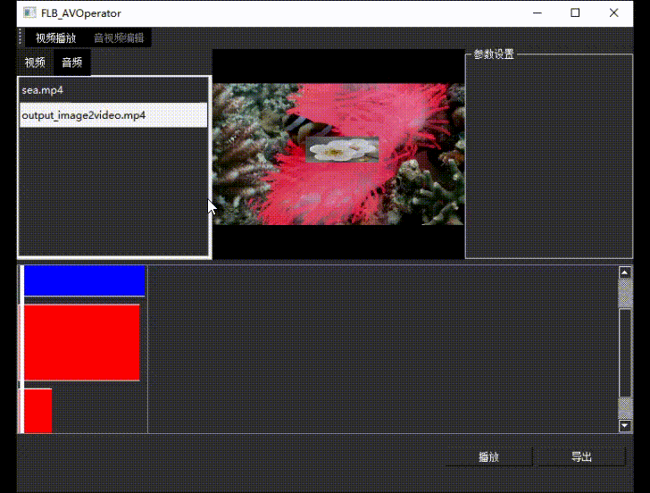
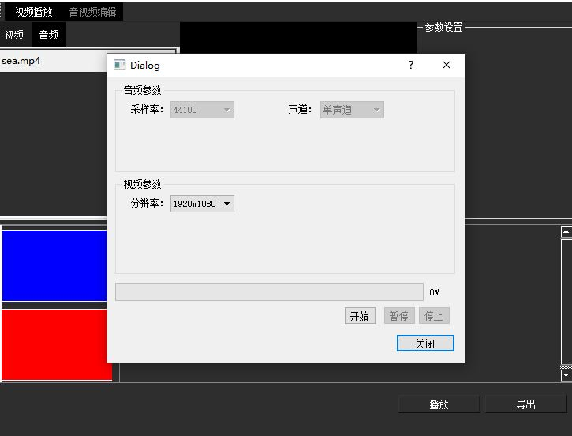

基于VS2019+QT5+ffmpeg开发的音视频播放、操作（编辑）软件
====

音视频播放
------
 音视频播放控制，如暂停、快进，进度条拖动，音量调整，视频视觉效果调整，变速等。 

上图有对话框调整亮度、色度指标，但录屏时没抓到窗口。 

音视频编辑与导出
----
音视频流导入导出，音视频流剪辑、调整、合成。 

目前仅支持导出mp4与mp3，输出参数目前支持不全。 

其他
----
待开发的功能还有很多，以后慢慢加
